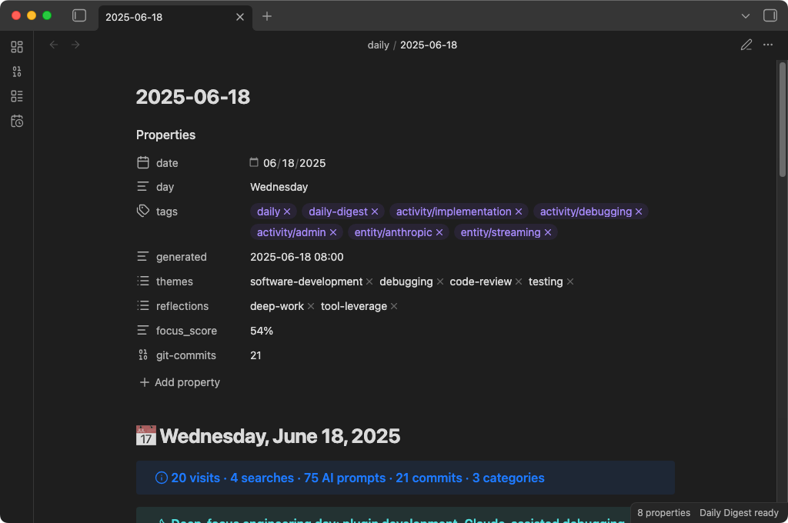
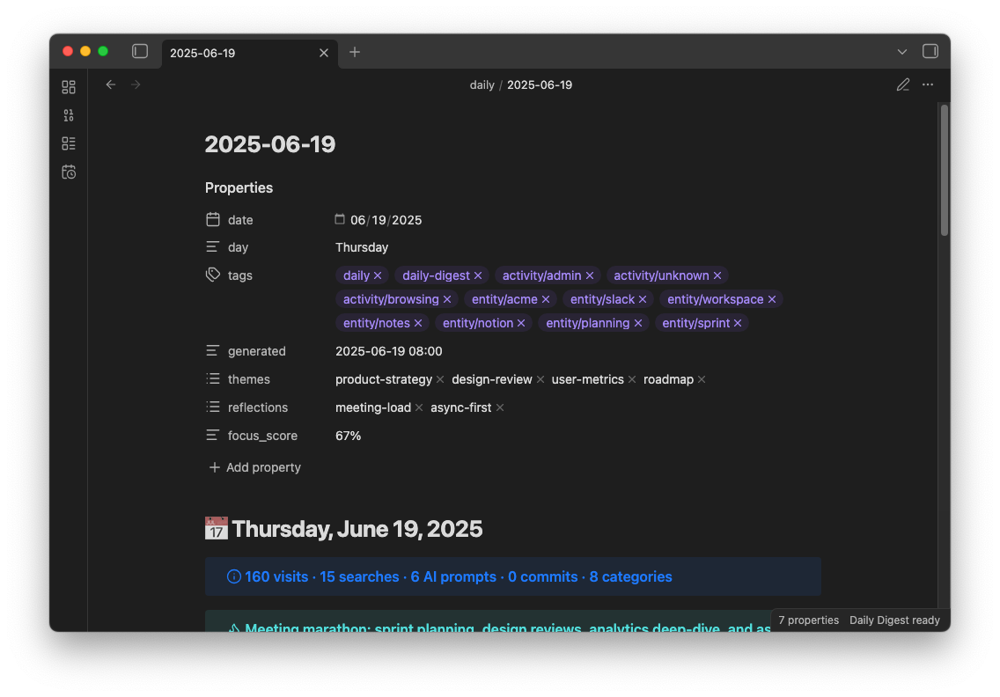
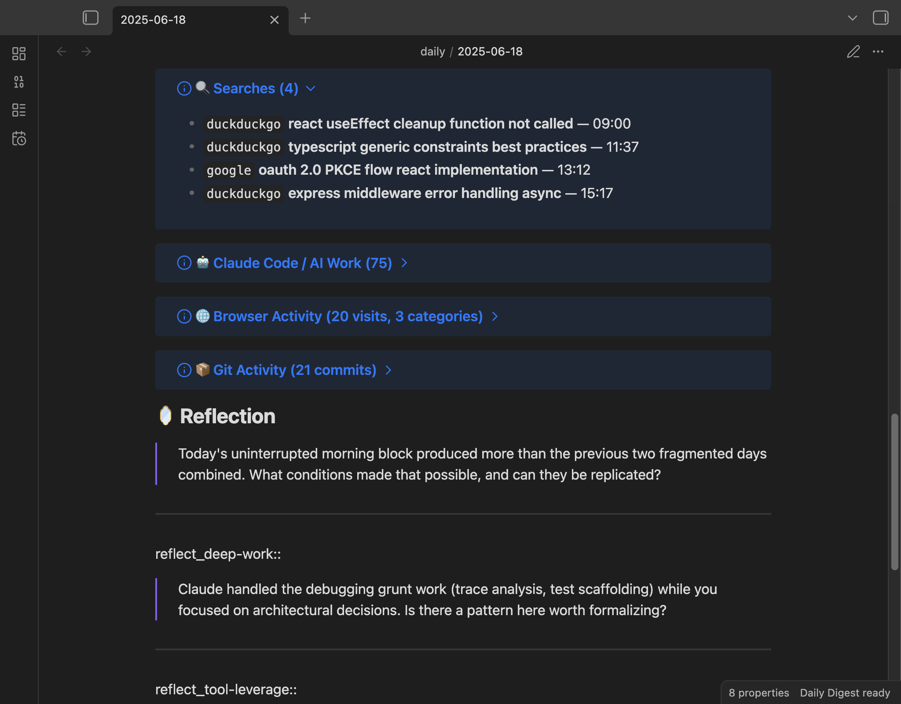

# Daily Digest for Obsidian

**Your day, distilled.** Daily Digest reads your browser history, search queries, Claude Code sessions, Codex CLI sessions, and git commits, then compiles everything into a single, AI-summarized daily note in your Obsidian vault.

One command. One note. A complete picture of what you did today.



---

## Why this exists

I kept forgetting what I worked on. Not the big stuff — the small stuff. The Stack Overflow rabbit hole at 2pm. The three search queries that led me to change my entire auth approach. The terminal command I ran that fixed the production bug.

Daily Digest captures all of that and turns it into something you can actually read tomorrow, next week, or six months from now.

## What it does

Every day (or whenever you want), Daily Digest:

1. **Collects** your browser history, search queries, [Claude Code](https://docs.anthropic.com/en/docs/claude-code) sessions, [Codex CLI](https://github.com/openai/codex) sessions, and git commits
2. **Sanitizes** everything — scrubs API keys, tokens, passwords, and sensitive URLs before anything touches your vault
3. **Categorizes** browser visits into meaningful groups (Dev, Research, Work, News, etc.)
4. **Summarizes** the whole day with AI — a headline, key themes, notable moments, and reflection questions
5. **Writes** a structured markdown note into your vault with frontmatter, tags, and Dataview-compatible fields

The result is a note that looks like this:



### Data sources

| Source | What it reads | How |
|--------|--------------|-----|
| **Browser history** | URLs, page titles, timestamps | SQLite databases (read-only copy) |
| **Search queries** | Queries from Google, Bing, DuckDuckGo, Yahoo, Kagi, Perplexity | Extracted from browser history URLs |
| **Claude Code sessions** | Your prompts to Claude Code (not responses) | `~/.claude/projects/**/*.jsonl` |
| **Codex CLI sessions** | Your prompts to Codex CLI (not responses) | `~/.codex/history/*.jsonl` |
| **Git commits** | Commit messages, timestamps, file change stats | Local `.git` directories under a configurable parent folder |

### Supported browsers

Chrome, Brave, Edge, and Firefox on macOS, Windows, and Linux. Safari on macOS only.

### AI providers

- **Local models** (Ollama, LM Studio, or any OpenAI-compatible server) — all data stays on your machine
- **Anthropic API** (Claude) — with a privacy escalation chain that controls exactly what gets sent

You can also skip AI entirely and just get the raw, organized activity log.

---

## Disclosures

### Network use

Daily Digest can optionally send data to **Anthropic's API** (`api.anthropic.com`) to generate AI summaries. This requires you to supply your own API key and is **disabled by default** — the plugin defaults to local AI models (Ollama, LM Studio) that keep all data on your machine. When Anthropic is enabled, a data preview is shown before any request is made, and a [4-tier privacy escalation chain](#the-privacy-escalation-chain) controls the minimum data necessary for the summary.

No other network requests are made. There is no telemetry, analytics, or tracking of any kind.

### Files accessed outside your vault

To collect activity data, the plugin reads files from outside your Obsidian vault. These are **read-only** operations — nothing outside your vault is modified. All sources are opt-in and disabled by default.

| Source | File path(s) | Why |
|--------|-------------|-----|
| **Browser history** | Platform-specific SQLite database inside the browser's profile directory (e.g., `~/Library/Application Support/Google/Chrome/…/History`) | To build a record of URLs you visited, including search queries extracted from them |
| **Claude Code sessions** | `~/.claude/projects/**/*.jsonl` | To include your AI coding prompts, grouped by project |
| **Codex CLI sessions** | `~/.codex/history/*.jsonl` | To include your Codex CLI prompts |
| **Git commits** | `.git/` directories under a configurable parent folder | To include commit messages and file change statistics |

---

## Installation

### From Obsidian Community Plugins (coming soon)

1. Open **Settings > Community plugins > Browse**
2. Search for **Daily Digest**
3. Click **Install**, then **Enable**

### Manual install

1. Download `main.js`, `manifest.json`, and `styles.css` from the [latest release](https://github.com/brianruggieri/obsidian-daily-digest/releases/latest)
2. Create a folder: `<your-vault>/.obsidian/plugins/daily-digest/`
3. Drop the three files into that folder
4. Restart Obsidian and enable the plugin in **Settings > Community plugins**

### Build from source

```bash
git clone https://github.com/brianruggieri/obsidian-daily-digest.git
cd obsidian-daily-digest
npm install
npm run build
```

Then copy `main.js`, `manifest.json`, and `styles.css` into your vault's plugin directory.

---

## Getting started

When you enable the plugin for the first time, you'll see an onboarding screen:


**Everything is off by default.** You choose which data sources to enable and whether you want AI summaries. Nothing is collected until you opt in.

### Quick setup

1. **Enable the data sources you want** — browser history, Claude Code sessions
2. **Choose an AI provider** (or skip AI for raw data only):
   - **Local model:** Install [Ollama](https://ollama.ai), pull a model (`ollama pull llama3.2`), and start the server (`ollama serve`). Your data never leaves your machine.
   - **Anthropic API:** Add your API key in settings or set the `ANTHROPIC_API_KEY` environment variable.
3. **Generate your first note** — click the calendar-clock icon in the ribbon, or use the command palette: `Daily Digest: Generate today's daily note`

### Commands

| Command | What it does |
|---------|-------------|
| **Generate today's daily note** | Collect, summarize, and write today's note |
| **Generate daily note for a specific date** | Same thing, but for any date you pick |
| **Generate today's daily note (no AI)** | Just the raw data, organized and categorized |

---

## The daily note

Here's what a generated note looks like:




### Structure

Every note includes:

- **Frontmatter** with date, tags, categories, themes, and focus score — ready for Dataview
- **AI headline and TL;DR** — a quick summary of your whole day
- **Themes** — 3-5 labels capturing what you were focused on
- **Notable moments** — the interesting stuff the AI picked out
- **Searches** — every query, with engine badges and timestamps
- **Claude Code / AI Work** — your prompts to Claude Code, grouped by project
- **Browser Activity** — visits organized by category (Dev, Research, Work, etc.) and grouped by domain
- **Reflection** — AI-generated questions with Dataview inline fields for your answers
- **Notes** — a section for your own thoughts (preserved across regenerations)

### Regeneration is safe

Already added notes to today's digest? No problem. When you regenerate:

- Your **Notes** section content is preserved
- Your **Reflection answers** are carried forward
- Any **custom sections** you added are kept
- A **timestamped backup** is created before any changes

If anything goes wrong during merge, your original content is never lost.

---

## Privacy architecture

Daily Digest was built with a simple principle: **your data is yours.**

### The defaults

- All data sources are **off by default** — you opt in to each one
- AI summarization defaults to **local models** — nothing leaves your computer
- Sensitive data is **scrubbed automatically** — API keys, tokens, passwords, emails, file paths
- A **419-domain sensitivity filter** catches embarrassing or private domains before they reach your notes

### The privacy escalation chain

When you use Anthropic's cloud API, Daily Digest doesn't just dump your raw data over the wire. It has a 4-tier system that controls exactly how much context the cloud model sees:

```
Tier 4 ─── De-identified ──── Only aggregated statistics. Zero per-event data.
  │         (Most private)     Topic distributions, focus scores, temporal shapes.
  │                            No individual URLs, queries, commands, or prompts.
  │
Tier 3 ─── Classified ─────── Structured abstractions only.
  │                            Activity types, topics, entities — no raw data.
  │
Tier 2 ─── RAG ────────────── Selected relevant chunks from your activity.
  │                            Subset of data, still contains raw content.
  │
Tier 1 ─── Standard ────────── Full context (sanitized). All data types included.
            (Least private)     Used only with local models by default.
```

The plugin automatically selects the most private tier available based on your configuration:

- **Classification + Patterns enabled?** Anthropic sees only Tier 4 — aggregated distributions and trends, nothing per-event.
- **Classification enabled?** Anthropic sees only Tier 3 — abstractions like "researched authentication" instead of your actual URLs and queries.
- **Local model?** All tiers run on your machine. Nothing is transmitted.

When Anthropic is your provider, you also get a **data preview modal** before anything is sent — showing exactly what data will leave your machine, with the option to cancel or proceed without AI.


### What gets scrubbed

The sanitization pipeline catches:

- GitHub tokens, Anthropic keys, OpenAI keys, AWS credentials
- Slack tokens, npm tokens, Stripe keys, SendGrid keys, JWTs
- Database connection strings with passwords
- Authorization headers, private key blocks
- Sensitive URL parameters (27 patterns: `token`, `key`, `secret`, `auth`, etc.)
- Email addresses, IP addresses, home directory paths

This runs **before** anything touches AI, your vault, or any external service.

### Sensitivity filter

For domains you'd rather not see in your daily notes at all, the built-in sensitivity filter covers 419 domains across 11 categories:

- Adult, gambling, dating, health, finance, drugs, weapons, piracy, VPN/proxy, job search, social/personal

You can add your own domains (including path-level filtering like `reddit.com/r/specific-subreddit`), and choose whether to **exclude** matching visits entirely or **redact** them to just a category label.

---

## Advanced features

### Event classification

Turn on event classification and your raw activity gets transformed into structured data:

- **Activity types:** research, debugging, implementation, infrastructure, writing, learning, admin, communication
- **Topics:** extracted noun phrases describing what you were working on
- **Entities:** tools, libraries, and technologies mentioned
- **Intent:** compare, implement, evaluate, troubleshoot, configure, explore

Classification runs **locally** on your machine (requires a local model). The structured output powers both the privacy escalation chain and the pattern extraction below.

### Pattern extraction

With classification enabled, Daily Digest can extract patterns from your day:

- **Temporal clusters** — when your activity concentrated and what you were doing
- **Topic co-occurrences** — which topics appeared together
- **Entity relations** — how tools and technologies connected across your work
- **Focus score** — a 0-100% measure of how scattered or focused your day was
- **Recurrence signals** — tracks topics across days to spot rising interests, returning themes, and stable focus areas

All pattern extraction is local and statistical — no LLM calls, just math on the classified events.

### RAG pipeline

For users with local models, the RAG (Retrieval-Augmented Generation) pipeline improves summary quality:

1. Activity data is split into focused chunks (by category, project, or batch)
2. Chunks are embedded using a local embedding model
3. The most relevant chunks are selected for the AI prompt

This is especially useful when you have a lot of activity data but a model with a small context window.

### Dataview integration

Reflection questions are rendered as inline fields:

```markdown
### What token storage strategy is safest for our SPA?
answer_what_token_storage_strategy_is_safest_for_our_spa:: httpOnly cookies with refresh rotation
```

Query your reflections across all daily notes with Dataview:

```dataview
TABLE answer_what_token_storage_strategy_is_safest_for_our_spa AS "Answer"
FROM #daily-digest
WHERE answer_what_token_storage_strategy_is_safest_for_our_spa
```

Frontmatter includes `focus_score`, `themes`, `categories`, and `tags` for powerful cross-day queries.

---

## Configuration

All settings live in **Settings > Daily Digest** within Obsidian.

| Setting | Default | What it does |
|---------|---------|-------------|
| Daily notes folder | `daily` | Where notes are created in your vault |
| Filename template | `YYYY-MM-DD` | Date format for filenames |
| Lookback hours | 24 | How far back to collect activity |
| Browsers | Chrome, Brave, Firefox, Safari | Which browsers to scan |
| AI provider | Local | Where AI processing happens |
| AI model | Claude Haiku 4.5 | Which model to use (if Anthropic) |
| Sanitization level | Standard | Standard or Aggressive URL cleaning |
| Sensitivity filter | Off | Domain-level content filtering |
| Classification | Off | Local LLM event classification |
| Pattern extraction | Off | Statistical pattern analysis |
| RAG pipeline | Off | Embedding-based context selection |

See the settings panel for detailed descriptions of each option and inline setup guides for local models.

---

## Development

### Prerequisites

- Node.js 22+ (see `.nvmrc` — run `nvm use` to switch automatically)
- npm 10+

### Setup

```bash
git clone https://github.com/brianruggieri/obsidian-daily-digest.git
cd obsidian-daily-digest
npm install
```

### Scripts

```bash
npm run dev              # Watch mode with hot reload
npm run build            # Type-check and production build
npm run lint             # ESLint
npm test                 # Run all tests (unit + integration)
npm run test:unit        # Unit tests only
npm run test:integration # Integration tests only
npm run test:eval        # AI evaluation tests (requires API key or local model)
npm run test:eval:local  # AI eval tests against local model
npm run test:coverage    # Coverage report (v8)
npm run deploy           # Build and copy to your local Obsidian vault
npm run deploy:dev       # Quick deploy without full rebuild
```

### Testing

The test suite includes 350+ test cases:

- **Unit tests** — sanitization, categorization, classification, pattern extraction, knowledge generation, rendering, summarization, merge safety
- **Integration tests** — full pipeline runs with 6 realistic personas, privacy escalation chain verification, multi-day topic recurrence
- **AI evaluation tests** — LLM-as-judge framework for summary quality, privacy auditing, knowledge value, and prompt injection resistance

To run AI eval tests, copy `.env.example` to `.env` and configure your provider:

```bash
cp .env.example .env
# Edit .env with your API key or local model settings
npm run test:eval
```

### Project structure

```
src/
  types.ts              TypeScript interfaces and constants
  plugin/
    main.ts             Plugin entry point, commands, vault integration
    privacy.ts          Consent modals and onboarding flow
  settings/
    types.ts            Settings interface, defaults, constants
    ui.ts               Settings tab UI
  collect/
    browser.ts          Browser history collection via sql.js
    browser-profiles.ts Multi-browser, multi-profile detection
    claude.ts           Claude Code session reading
    codex.ts            Codex CLI session reading
    git.ts              Git commit history collection
  filter/
    sanitize.ts         Defense-in-depth secret scrubbing
    sensitivity.ts      419-domain sensitivity filter
    categorize.ts       Rule-based domain categorization
    classify.ts         Local LLM event classification
  analyze/
    patterns.ts         Statistical pattern extraction
    knowledge.ts        Knowledge section generation
  summarize/
    summarize.ts        AI prompt building and routing
    prompt-templates.ts Prompt templates
    ai-client.ts        Anthropic + local model abstraction
    compress.ts         Token-budget activity compression
    chunker.ts          RAG chunking pipeline
    embeddings.ts       Vector embeddings and retrieval
  render/
    renderer.ts         Markdown generation
    merge.ts            Safe content merging with backups
```

---

## Platform support

Daily Digest is **desktop only** (`isDesktopOnly: true`) — it requires filesystem access not available on mobile.

| Feature | macOS | Windows | Linux |
|---|---|---|---|
| Browser history (Chrome, Brave, Edge) | ✓ | ✓ | ✓ |
| Browser history (Firefox) | ✓ | ✓ | ✓ |
| Browser history (Safari) | ✓ | — | — |
| Claude Code sessions | ✓ | ✓ | ✓ |
| Codex CLI sessions | ✓ | ✓ | ✓ |
| Git commits | ✓ | ✓ | ✓ |

Browser history is read using [sql.js](https://github.com/sql-js/sql.js) (SQLite compiled to WebAssembly) — no native binaries, no system dependencies. The wasm binary (~1.2 MB) is bundled inline.

---

## FAQ

**Does this work without AI?**
Yes. The "Generate today's daily note (no AI)" command gives you a fully structured activity log with categorized browser visits, searches, and Claude Code sessions — just no headline, summary, or reflection questions.

**Does my data leave my computer?**
Only if you choose Anthropic as your AI provider. With a local model (or no AI), everything stays on your machine. Even with Anthropic, the privacy escalation chain minimizes what gets sent.

**Will this slow down Obsidian?**
No. Generation takes 3-6 seconds (mostly waiting for the AI response) and only runs when you trigger it. There are no background processes.

**What if I regenerate a note I already edited?**
Your custom content is preserved. Daily Digest extracts your notes, reflection answers, and any custom sections, creates a backup, then merges everything into the fresh note.

**Can I use this with Obsidian Sync / iCloud / Dropbox?**
Yes, but be aware that your daily notes (which contain your activity data) will be synced to those services. If you store an Anthropic API key in the plugin settings, that gets synced too — consider using the `ANTHROPIC_API_KEY` environment variable instead.

---

## Roadmap

Features already shipped are in the current release. The following are planned but **not yet implemented**:

**Cross-day embeddings**
- Persist each day's embedding index and enable semantic search across a date range
- Previously stubbed in `embeddings.ts`; stubs have been removed. Will be re-implemented when ready.

**Platform expansion**

---

## Contributing

Contributions are welcome! If you'd like to help:

1. Fork the repository
2. Create a feature branch (`git checkout -b feature/my-feature`)
3. Make your changes with tests
4. Run `npm test` and `npm run lint`
5. Open a pull request

Please open an issue first for major changes so we can discuss the approach.

### AI-assisted contributions

AI-assisted contributions are welcome. If you used AI tools (Copilot, Claude, Codex, etc.), mention it in your PR description with a brief note on scope (e.g., "Claude helped with the regex" or "Codex generated initial test scaffolding"). No need to disclose trivial autocomplete.

What matters is that you understand the code you're submitting and can explain your changes during review.

---

## Built with AI

This project was developed extensively with AI coding tools, primarily [Claude Code](https://docs.anthropic.com/en/docs/claude-code). AI assisted with implementation, testing, and documentation across the codebase.

All code is human-reviewed, tested (350+ test cases), and maintained by [Brian Ruggieri](https://github.com/brianruggieri). The architecture, product decisions, and quality standards are mine — the AI accelerated getting there.

---

## License

[MIT](LICENSE) - 2026 Brian Ruggieri
